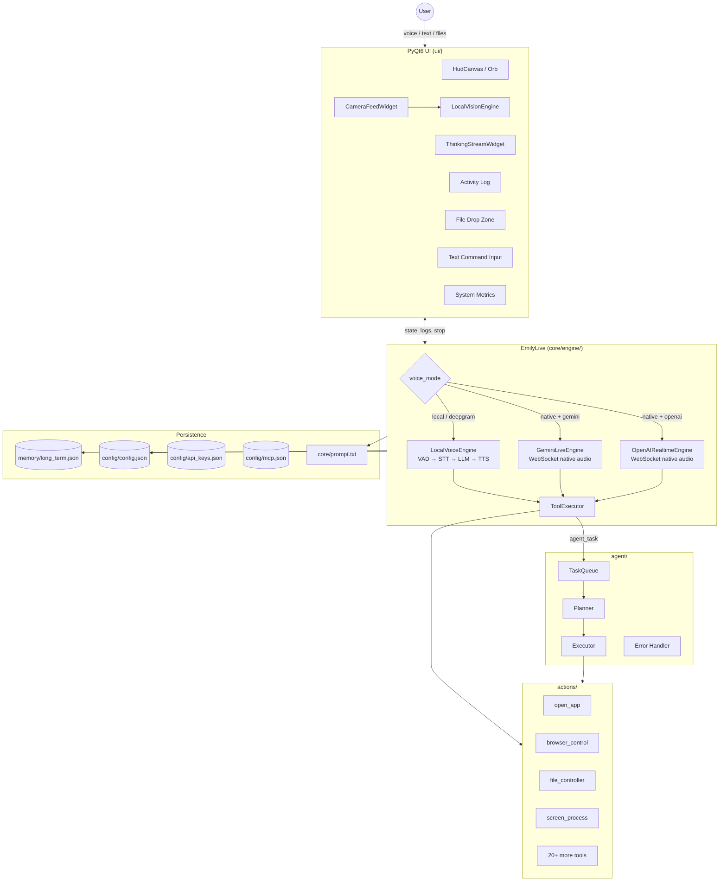
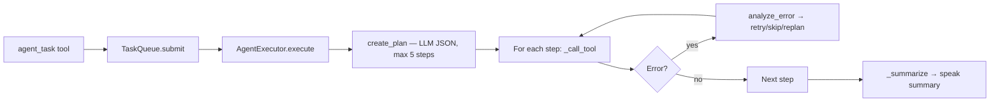

# E.M.I.L.Y. — System Architecture

**E.M.I.L.Y.** (Efficient Machine Intelligence for Local Yield) is a cross-platform, voice-first desktop AI assistant. It runs on the user's machine, connects to configurable LLM backends, and exposes a large set of function-calling tools for OS automation, browser control, vision, coding, and scheduling.

The product goal is a single conversational interface that can **hear**, **speak**, **remember** personal facts, and **act** on the computer without the user switching tools.

---

## Table of Contents

1. [Design Principles](#design-principles)
2. [High-Level Architecture](#high-level-architecture)
3. [Runtime & Threading Model](#runtime--threading-model)
4. [Repository Layout](#repository-layout)
5. [Startup Sequence](#startup-sequence)
6. [Presentation Layer (`ui/`)](#presentation-layer-ui)
7. [Orchestration Layer (`core/engine/`)](#orchestration-layer-coreengine)
8. [Voice Pipelines (`core/voice/`)](#voice-pipelines-corevoice)
9. [LLM Layer (`core/llm/`)](#llm-layer-corellm)
10. [Tool System (`core/tools/`)](#tool-system-coretools)
11. [Action Modules (`actions/`)](#action-modules-actions)
12. [Multi-Step Agent (`agent/`)](#multi-step-agent-agent)
13. [Memory (`memory/`)](#memory-memory)
14. [Vision](#vision)
15. [Configuration (`core/config.py`)](#configuration-coreconfigpy)
16. [MCP Integration (`core/mcp/`)](#mcp-integration-coremcp)
17. [GPU Acceleration for Local TTS](#gpu-acceleration-for-local-tts)
18. [Cross-Platform Behavior](#cross-platform-behavior)
19. [Security & Safety](#security--safety)
20. [Extension Points](#extension-points)
21. [Key Dependencies](#key-dependencies)

---

## Design Principles

| Principle | Implementation |
|-----------|----------------|
| **Voice-first** | Microphone is the primary input; text and file drop are secondary channels |
| **Tool-using agent** | The LLM calls typed functions; Emily executes them and returns structured results |
| **Provider-agnostic** | Same tool surface works across Gemini, OpenAI, Anthropic, Ollama, and LM Studio |
| **Pluggable voice** | Three pipelines: fully local, cloud Deepgram, or native realtime WebSocket |
| **Local + cloud hybrid** | Batch LLM for reasoning; optional cloud STT/TTS; local CV for sleep mode |
| **Fail-soft engine** | `EmilyLive.run()` restarts the voice engine after errors (3 s backoff) |
| **User cancellation** | Stop button cancels tools, drains queues, stops TTS, and clears agent tasks |

---

## High-Level Architecture

Emily splits into five cooperating layers:

| Layer | Responsibility | Primary modules |
|-------|----------------|-----------------|
| **UI** | Window, HUD, sidebar camera, thinking stream, logs, metrics | `ui/app.py` |
| **Local vision** | Webcam face/object detection (no LLM) | `vision/local_detector.py` |
| **Orchestrator** | Voice pipeline, tool loop, conversation history | `core/engine/` (`EmilyLive` facade) |
| **Tools** | Single-purpose capabilities invoked by the model | `actions/*.py` |
| **Agent** | Plan → execute multi-step goals off the live session | `agent/*.py` |



### Typical voice turn (local mode)

1. Microphone streams PCM chunks through `VADSegmenter` until end-of-utterance.
2. `STT` transcribes the utterance → `utterance_queue`.
3. `LocalVoiceEngine._process_turn` calls `LLMProvider.chat()` with tool declarations.
4. If the model emits `tool_calls`, `ToolExecutor.execute()` runs each handler (often on a thread pool).
5. Tool results are appended to conversation history; the model continues (up to 8 tool rounds).
6. Final reply is spoken via `speak_sync` (Supertonic or Deepgram) and logged to the HUD.

---

## Runtime & Threading Model

```
┌─────────────────────────────────────────────────────────────┐
│  Main thread (Qt)                                           │
│  main.py → EmilyUI → QApplication.exec()                    │
│  Camera capture, paint events, user input, sleep-mode timer │
└──────────────────────────┬──────────────────────────────────┘
                           │ pyqtSignal / callbacks
                           │ on_text_command, on_stop, set_state
┌──────────────────────────▼──────────────────────────────────┐
│  Daemon thread (asyncio)                                    │
│  EmilyLive.run() → voice engine coroutines                  │
│  Mic callback → VAD → STT → queues → LLM → tools → TTS    │
└──────────────────────────┬──────────────────────────────────┘
                           │
         ┌─────────────────┼─────────────────┐
         ▼                 ▼                 ▼
   Thread pool      Background threads   Agent worker
   (run_in_executor) (screen_process,    (TaskQueue)
                      shutdown)
```

| Thread / loop | Owner | Blocking work |
|---------------|-------|---------------|
| Qt main | `ui/app.py` | Rendering, widgets, camera frames |
| Asyncio (daemon) | `EmilyLive` | Mic stream, LLM orchestration, realtime WS |
| `run_in_executor` | `ToolExecutor` | Playwright, PyAutoGUI, file I/O |
| Agent worker | `agent/task_queue.py` | Multi-step plan execution |
| Vision thread | `screen_processor` | Screen capture + LLM vision + TTS |

**Thread-safety:** `EmilyUI` exposes Qt signals (`write_log`, `set_state`, `append_thinking`) so the engine thread never touches widgets directly.

---

## Repository Layout

```
Emily/
├── main.py                     # Entry point
├── Setup.bat                   # Windows first-time install + --setup
├── start.bat                   # Windows daily launcher
├── setup.py                    # pip + Playwright helper
├── requirements.txt            # Python dependencies
├── face.png                    # Orb avatar image
│
├── config/                     # Runtime JSON (not the config API itself)
│   ├── config.json             # User preferences
│   ├── api_keys.json           # Secrets (never commit)
│   └── mcp.json                # MCP server definitions
│
├── ui/                         # PyQt6 desktop HUD
│   ├── app.py                  # EmilyUI, MainWindow, camera, metrics
│   ├── floating_orb.py         # Compact floating orb (Ctrl+M)
│   └── orb_widget.py           # Orb animation mixin
│
├── core/
│   ├── config.py               # Central configuration API
│   ├── onboarding.py           # Terminal setup wizard
│   ├── devices.py              # Mic/camera enumeration
│   ├── prompt.txt              # Core persona / behavior rules
│   ├── user_info.txt           # User-specific context
│   ├── engine/                 # Voice engine implementations
│   ├── llm/                    # Multi-provider LLM abstraction
│   ├── voice/                  # STT, TTS, VAD, GPU detect, policy
│   ├── tools/                  # ToolExecutor (shared dispatch)
│   ├── mcp/                    # MCP client + tool registry
│   └── vision/                 # Gemini Live vision helper
│
├── actions/                    # Tool implementations (19 modules)
├── agent/                      # Multi-step planner + executor
├── memory/                     # Long-term JSON memory
├── vision/                     # Local OpenCV CV (no LLM)
└── scripts/
    └── ensure_onnxruntime.py   # GPU-matched ONNX Runtime installer
```

---

## Startup Sequence

### Windows (`Setup.bat` / `start.bat`)

1. Create `.venv` if missing
2. `pip install -r requirements.txt`
3. `scripts/ensure_onnxruntime.py` — swap ONNX Runtime wheel for GPU profile
4. `playwright install` (first setup only)
5. `python main.py` or `python main.py --setup`

### Linux / macOS

1. `pip install -r requirements.txt`
2. `python scripts/ensure_onnxruntime.py` (recommended for local voice)
3. `python -m playwright install`
4. `python main.py --setup` (first run) or `python main.py`

### Application bootstrap (`main.py`)

1. `ensure_onboarded()` — terminal wizard if `onboarding_complete` is false
2. `EmilyUI("face.png")` — Qt app starts; mic begins **muted**
3. Daemon thread: `asyncio.run(EmilyLive.run())`
4. Engine bootstraps voice stack → `ui.set_voice_ready()` → **unmutes** → `LISTENING`

---

## Presentation Layer (`ui/`)

The UI is a F.R.I.D.A.Y./JARVIS-style PyQt6 HUD: holographic palette, animated central orb, telemetry bars, mission log, neural trace (thinking stream), file drop zone, and webcam preview.

### Key classes

| Class | File | Role |
|-------|------|------|
| `EmilyUI` | `ui/app.py` | Public facade; thread-safe signals for engine callbacks |
| `MainWindow` | `ui/app.py` | Full HUD layout, mute/sleep/stop, settings |
| `HudCanvas` | `ui/app.py` | Central orb + state visualization |
| `CameraFeedWidget` | `ui/app.py` | Webcam capture, face presence, CV overlays |
| `FloatingOrbWindow` | `ui/floating_orb.py` | Compact mode (minimize / Ctrl+M) |
| `OrbAnimatorMixin` | `ui/orb_widget.py` | Orb animation rendering |

### HUD state machine

```
INITIALISING → THINKING → LISTENING ↔ SPEAKING
                ↓              ↓
            PROCESSING      SLEEP / MUTED
```

| State | Meaning |
|-------|---------|
| `INITIALISING` | App starting; voice stack loading |
| `LISTENING` | Mic active; waiting for user |
| `THINKING` | LLM or tool executing |
| `SPEAKING` | TTS or realtime audio playing |
| `SLEEP` | Face not detected; mic muted |
| `MUTED` | User muted mic manually |

### Engine ↔ UI contract

| Method / property | Direction | Purpose |
|-------------------|-----------|---------|
| `set_state(state)` | Engine → UI | Update orb/HUD visual state |
| `set_voice_ready()` | Engine → UI | Unmute mic after voice stack loads |
| `write_log(text)` | Engine → UI | Append to mission log |
| `append_thinking_line` | Engine → UI | Neural trace during tool calls |
| `on_text_command` | UI → Engine | Typed command or file-upload prompt |
| `on_stop` | UI → Engine | Cancel tools, TTS, agent tasks |
| `muted`, `sleep_mode` | Engine reads | Mic gating in voice engines |
| `current_file` | Engine reads | File drop zone path for `file_processor` |
| `get_camera_detections()` | Engine reads | Local CV results from webcam |

### Sleep mode

When `sleep_mode_enabled` is true, `CameraFeedWidget` runs Haar face detection on the webcam feed. If no face is detected for `sleep_face_timeout_sec` seconds, the HUD enters `SLEEP` and the mic is muted. When a face returns, a wake greeting plays via `speak_ui`.

---

## Orchestration Layer (`core/engine/`)

`EmilyLive` is the central host. It owns asyncio queues, speaking state, tool cancellation, and the active voice engine instance.

### `EmilyLive` (`core/engine/__init__.py`)

| Responsibility | Detail |
|----------------|--------|
| Queue management | `_utterance_queue` (voice), `_text_queue` (typed/file commands) |
| Engine factory | `_create_engine()` picks pipeline from `voice_mode` + `llm_provider` |
| Speech routing | `speak()` → live session or local TTS via `_speak_async` |
| Cancellation | `stop_current_action()` drains queues, cancels tasks, stops TTS/vision |
| Restart loop | On engine crash, waits 3 s and rebuilds session |

### Engine selection

| `voice_mode` | `llm_provider` | Engine class |
|--------------|----------------|--------------|
| `native` | `gemini` | `GeminiLiveEngine` |
| `native` | `openai` | `OpenAIRealtimeEngine` |
| `local` | any batch provider | `LocalVoiceEngine` |
| `deepgram` | any batch provider | `LocalVoiceEngine` (Deepgram STT/TTS) |

### `LocalVoiceEngine` (`core/engine/local_voice.py`)

Batch conversation loop for `local` and `deepgram` voice modes.

**Concurrency model:**

```
asyncio.gather(
    _listen_and_transcribe(),   # mic → VAD → STT → utterance_queue
    _turn_processor(),          # merge text_queue + utterance_queue → _process_turn
)
```

**Turn processing:**

- Builds messages: system prompt + rolling history (max 20 turns)
- Calls `LLMProvider.chat(messages, tools)` in a thread
- Executes up to **8 tool rounds** per user turn
- Speaks final reply via `_speak_local` → `speak_sync`
- Optional **fallback search**: if model promises to search but doesn't call `web_search`, Emily auto-invokes search and re-prompts

### `GeminiLiveEngine` (`core/engine/gemini_live.py`)

- WebSocket session via `google.genai` Live API
- 16 kHz PCM mic in, 24 kHz audio out (`AudioOutputPlayer`)
- Inline function declarations converted via `to_gemini_declarations()`
- `can_speak` property gates ancillary TTS when session is busy

### `OpenAIRealtimeEngine` (`core/engine/openai_realtime.py`)

- OpenAI Realtime WebSocket with server-side VAD
- Function calls dispatched through the same `ToolExecutor`

### System prompt assembly (`core/engine/prompts.py`)

`build_system_message()` concatenates:

1. Current local datetime
2. Formatted long-term memory (`memory/memory_manager.py`)
3. `core/prompt.txt` (persona, tool rules, voice guidelines)
4. `core/user_info.txt` (user-specific context)

`plain_text_for_speech()` strips markdown before TTS output.

---

## Voice Pipelines (`core/voice/`)

| Mode | STT | TTS | VAD | LLM |
|------|-----|-----|-----|-----|
| `local` | faster-whisper | Supertonic 3 (ONNX) | Silero VAD | Batch provider |
| `deepgram` | Deepgram Nova | Deepgram Aura | Energy-based VAD | Batch provider |
| `native` | Provider (WS) | Provider audio out | Provider VAD | Gemini Live / OpenAI Realtime |

### Module reference

| Module | Key symbols | Role |
|--------|-------------|------|
| `policy.py` | `speak_ui`, `set_live_session` | Route speech to live session or local TTS |
| `vad.py` | `VADSegmenter` | End-of-utterance detection |
| `stt.py` | `FasterWhisperSTT`, `DeepgramSTT`, `get_stt_engine()` | Speech-to-text factory |
| `tts.py` | `speak_sync`, `stop_speech`, `preload_tts()` | Supertonic or Deepgram TTS |
| `deepgram_client.py` | `get_deepgram_client()` | Thread-safe Deepgram SDK singleton |
| `gpu_detect.py` | `detect_gpu_accel_profile()` | GPU classification + ONNX provider selection |

### Supertonic provider patching

Supertonic hardcodes CPU-only ONNX providers. Before `TTS()` init, `tts.py` patches:

```python
import supertonic.config as st_config
st_config.DEFAULT_ONNX_PROVIDERS = resolve_ort_providers(profile)
```

### Ancillary speech routing

Vision narration, reminders, errors, and wake greetings use `speak_ui()`:

- If a live session exists and `can_speak` → send text to realtime session
- Otherwise → `speak_sync` (Supertonic or Deepgram)

---

## LLM Layer (`core/llm/`)

### Provider abstraction

| Class | Provider | API |
|-------|----------|-----|
| `GeminiProvider` | Gemini | `google.genai` chat + tools + multimodal |
| `OpenAIProvider` | OpenAI | Chat Completions |
| `AnthropicProvider` | Anthropic | Messages API |
| `OpenAICompatProvider` | Ollama / LM Studio | OpenAI-compatible `/v1/chat/completions` |

`factory.get_llm_provider()` returns a cached singleton based on `config.llm_provider`.

### Shared types (`core/llm/types.py`)

```python
Message(role, content, tool_calls?, tool_call_id?, name?)
ToolCall(id, name, arguments)
CompletionResponse(text, tool_calls)
```

### Tool schema pipeline

```
TOOL_DECLARATIONS (core/llm/tool_declarations.py)
        ↓
get_active_tool_declarations()  — filters MCP tools by config/mcp.json
        ↓
to_openai_tools / to_gemini_declarations / to_anthropic_tools
        ↓
LLM provider (batch chat or Live session)
        ↓
ToolExecutor → actions/*
```

### Helpers (`core/llm/helpers.py`)

- `llm_complete` — one-shot completion for agent, reminders, vision
- `llm_multimodal` — image + text for screen/camera analysis

---

## Tool System (`core/tools/`)

`ToolExecutor` is the single dispatch hub for all LLM tool calls, shared by local and realtime engines.

### Execution flow

1. Check `_tool_cancel` — return early if user pressed Stop
2. Set UI state to `THINKING`; append to neural trace
3. Route by `tc.name` to the matching `actions/*` function
4. Run blocking work via `run_in_executor` or `run_blocking` with timeouts
5. Truncate result (8 000 chars default; 24 000 for Firecrawl)
6. Restore UI state to `LISTENING`

### Timeouts

| Tool category | Timeout |
|---------------|---------|
| Default | 25 s |
| `web_search` | 45 s |
| `firecrawl_scrape` | 200 s |
| `firecrawl_search` | 90 s |
| `firecrawl_crawl` | 180 s |

### Special handlers

| Tool | Behavior |
|------|----------|
| `save_memory` | Writes to `memory/long_term.json` via `update_memory` |
| `agent_task` | Submits goal to `agent.task_queue` (async, non-blocking) |
| `screen_process` | Spawns daemon thread; vision speaks via TTS independently |
| `shutdown_emily` | Speaks goodbye, then `os._exit(0)` |

### Active tool inventory

Core tools (always available): `open_app`, `web_search`, `weather_report`, `send_message`, `reminder`, `youtube_video`, `screen_process`, `computer_settings`, `browser_control`, `file_controller`, `desktop_control`, `code_helper`, `dev_agent`, `agent_task`, `computer_control`, `game_updater`, `flight_finder`, `file_processor`, `save_memory`, `shutdown_emily`

Optional MCP tools (enabled when server configured in `mcp.json`):

| Server | Tools |
|--------|-------|
| `massive` | `massive_stock_quote`, `massive_options_chain`, `massive_search_endpoints`, `massive_call_api`, `massive_query_data` |
| `firecrawl` | `firecrawl_scrape`, `firecrawl_search`, `firecrawl_map`, `firecrawl_crawl` |

---

## Action Modules (`actions/`)

Each action module exposes a primary function matching the tool name. Most accept `parameters: dict` and optional `player` (`EmilyUI`) for logging.

| Module | Entry function | Capability |
|--------|----------------|------------|
| `open_app.py` | `open_app` | Launch apps/URLs (OS-aware) |
| `web_search.py` | `web_search` | DuckDuckGo + optional provider search |
| `weather_report.py` | `weather_action` | Weather by city |
| `browser_control.py` | `browser_control` | Playwright automation (headless by default) |
| `file_controller.py` | `file_controller` | File/folder CRUD, search, disk usage |
| `file_processor.py` | `file_processor` | Multimodal analysis (images, PDF, code, Office) |
| `send_message.py` | `send_message` | Desktop automation for messaging apps |
| `reminder.py` | `reminder` | OS schedulers + spoken briefings |
| `youtube_video.py` | `youtube_video` | Play, summarize, trending |
| `screen_processor.py` | `screen_process` | Screen/camera → LLM vision + TTS |
| `computer_settings.py` | `computer_settings` | Volume, brightness, hotkeys, WiFi, power |
| `computer_control.py` | `computer_control` | PyAutoGUI mouse/keyboard/screen find |
| `desktop.py` | `desktop_control` | Wallpaper, organize, clean desktop |
| `code_helper.py` | `code_helper` | Write/edit/run/explain code |
| `dev_agent.py` | `dev_agent` | Scaffold multi-file projects with fix loop |
| `game_updater.py` | `game_updater` | Steam/Epic install, update, schedule |
| `flight_finder.py` | `flight_finder` | Google Flights search + LLM parse |
| `massive.py` | `massive_*` | Financial data via Massive MCP |
| `firecrawl.py` | `firecrawl_*` | Web scrape/search via Firecrawl MCP |

**Common signature:**

```python
def tool_name(parameters: dict, player=None, speak=None, ...) -> str
```

---

## Multi-Step Agent (`agent/`)

The agent system handles goals too complex for a single tool call. It is triggered exclusively via the `agent_task` tool.



| Module | Role |
|--------|------|
| `planner.py` | `create_plan`, `replan` — LLM produces JSON step list from `PLANNER_PROMPT` |
| `executor.py` | `AgentExecutor` — runs steps, injects file context, calls action functions |
| `error_handler.py` | `analyze_error` — LLM decides retry, skip, replan, or abort |
| `task_queue.py` | Priority queue, single concurrent worker, cancel support |

**Distinction from `ToolExecutor`:**

| | `ToolExecutor` | `AgentExecutor` |
|--|----------------|-----------------|
| Trigger | Conversational LLM tool call | `agent_task` submission |
| Scope | Single tool invocation | Multi-step plan (≤ 5 steps, ≤ 2 replans) |
| Thread | Asyncio executor / daemon thread | Dedicated `TaskQueue` worker |
| Planning | None (model decides each turn) | Dedicated planner LLM prompt |

---

## Memory (`memory/`)

Long-term memory persists user facts in `memory/long_term.json` and injects them into every system prompt.

### Categories

`identity`, `preferences`, `projects`, `relationships`, `wishes`, `notes`

### API (`memory/memory_manager.py`)

| Function | Purpose |
|----------|---------|
| `load_memory()` | Read JSON (thread-safe) |
| `update_memory(patch)` | Merge category/key/value entries |
| `format_memory_for_prompt()` | Render for system message |
| `remember(category, key, value)` | Convenience write |
| `forget(category, key)` | Remove entry |

### Size management

- Per-value cap: 380 characters
- Total memory cap: ~2 200 characters
- LRU-style trim by `updated` timestamp when over limit

---

## Vision

Emily has two distinct vision paths:

### 1. Local CV (`vision/local_detector.py`) — no LLM

| Class | Role |
|-------|------|
| `Detection` | Label, confidence, bounding box, kind |
| `LocalVisionEngine` | Haar face detection; optional HOG people + MobileNet-SSD objects |

**Used by:** `CameraFeedWidget` for sleep-mode face presence and optional HUD overlays.

Models download to `~/.emily/models/` on first use (MobileNet-SSD).

### 2. LLM vision (`actions/screen_processor.py`) — tool-triggered

| Input | Capture method |
|-------|----------------|
| `angle=screen` | `mss` screenshot |
| `angle=camera` | OpenCV webcam frame |

Flow:

1. LLM calls `screen_process` tool
2. Emily captures image → `llm_multimodal` or Gemini Live path
3. Vision module speaks result via TTS (model stays silent during this)
4. User hears the analysis aloud

---

## Configuration (`core/config.py`)

All configuration I/O goes through `core/config.py`. The `config/` directory holds JSON files only.

### File split

| File | Contents | Committed? |
|------|----------|------------|
| `config/config.json` | User preferences, device indices, voice mode | Yes (no secrets) |
| `config/api_keys.json` | API keys, local server URLs | **Never** |
| `config/mcp.json` | MCP server commands and env vars | Optional |

### Key preference fields

| Key | Values / notes |
|-----|----------------|
| `llm_provider` | `gemini`, `openai`, `anthropic`, `ollama`, `lmstudio` |
| `voice_mode` | `local`, `deepgram`, `native` |
| `llm_model` | Batch chat model name |
| `stt_model` | Whisper size or Deepgram model |
| `tts_voice` | Supertonic voice ID or Deepgram Aura voice |
| `live_model` / `live_voice` | Realtime session config (native mode) |
| `os_system` | `windows`, `mac`, `linux` — drives action branches |
| `supertonic_accel` | `auto`, `cpu`, `cuda`, `webgpu`, `directml` |
| `sleep_mode_enabled` | Face-detection mic mute |
| `onboarding_complete` | Skip wizard when true |

### Onboarding (`core/onboarding.py`)

Terminal wizard run via `python main.py --setup`:

1. Operating system
2. LLM provider + credentials
3. Voice pipeline + model/voice selection
4. Microphone and camera device indices
5. Validation loop (re-prompts on invalid API keys)

---

## MCP Integration (`core/mcp/`)

Emily supports [Model Context Protocol](https://modelcontextprotocol.io/) servers for optional tool extensions.

| Module | Role |
|--------|------|
| `registry.py` | Filters `TOOL_DECLARATIONS` by configured MCP servers |
| `client.py` | `MCPClientManager` — subprocess MCP tool invocation |

### Example `config/mcp.json`

```json
{
    "mcpServers": {
        "massive": {
            "command": "npx",
            "args": ["-y", "@massive/mcp-server"],
            "env": { "MASSIVE_API_KEY": "your-key" }
        },
        "firecrawl": {
            "command": "npx",
            "args": ["-y", "firecrawl-mcp"],
            "env": { "FIRECRAWL_API_KEY": "your-key" }
        }
    }
}
```

Tools from unconfigured servers are excluded from the LLM's tool list entirely.

---

## GPU Acceleration for Local TTS

When `voice_mode` is `local`, Supertonic 3 uses ONNX Runtime. Emily auto-detects the dedicated GPU and installs the matching wheel via `scripts/ensure_onnxruntime.py`.

| GPU class | Package | Provider chain |
|-----------|---------|----------------|
| No dedicated GPU | `onnxruntime` | `CPUExecutionProvider` |
| NVIDIA discrete | `onnxruntime-gpu` | `CUDAExecutionProvider`, `CPUExecutionProvider` |
| AMD / Intel Arc / other | `onnxruntime-webgpu` | `WebGpuExecutionProvider`, `CPUExecutionProvider` |
| WebGPU unavailable (Windows) | `onnxruntime-directml` | `DmlExecutionProvider`, `CPUExecutionProvider` |

Detection (`core/voice/gpu_detect.py`):

- **Windows:** WMI via PowerShell, with `EnumDisplayDevicesW` fallback
- **Linux:** `lspci` parsing
- **macOS:** CPU-only ONNX path

Override via `supertonic_accel` in `config.json`.

---

## Cross-Platform Behavior

`os_system` in config drives branches across action modules:

| Feature | Windows | macOS | Linux |
|---------|---------|-------|-------|
| App launch | `start`, registry | `open` | `xdg-open` / binary lookup |
| Reminders | Task Scheduler (+ recurring XML) | `launchd` calendar intervals | `systemd` calendar / `cron` / `at` |
| Scheduled TTS briefings | Generated `.py` in `~/.emily/reminders/` | Same | Same |
| Volume | PyAutoGUI / `pycaw` | `osascript` | `pactl` |
| Steam games | Registry + `steam.exe` | `.app` bundle paths | `~/.steam` |
| Desktop path | `%USERPROFILE%\Desktop` | `~/Desktop` | XDG or `~/Desktop` |
| GPU metrics (UI) | WMI / `nvidia-smi` | `nvidia-smi` | `nvidia-smi` / psutil sensors |

Some packages in `requirements.txt` (`pycaw`, `pywinauto`, `win10toast`, `comtypes`) are Windows-specific but listed for pip compatibility; they are only imported on Windows.

---

## Security & Safety

| Topic | Detail |
|-------|--------|
| API keys | Plaintext in `config/api_keys.json` — exclude from version control |
| File access | `file_controller` refuses paths outside user home roots |
| Screenshots | `computer_control` prefers paths under home |
| Browser profiles | Playwright can attach to real browser sessions (cookies) — high privilege |
| PyAutoGUI FAILSAFE | Corner-abort enabled in several automation modules |
| Agent code execution | `dev_agent` / agent fallback runs generated Python in temp files with 120 s timeout |
| No auth layer | Single-user local assistant; not designed for network exposure |
| Stop button | Cancels in-flight tools, TTS, vision audio, and agent queue |

---

## Extension Points

| To add… | Touch |
|---------|-------|
| New tool | `core/llm/tool_declarations.py` + `actions/new_action.py` + branch in `core/tools/executor.py` |
| New LLM provider | `core/llm/<provider>.py` + `factory.py` + `PROVIDERS` in `core/config.py` |
| New voice mode | `VOICE_MODES` in config + new engine class + `_create_engine()` |
| New MCP server | `config/mcp.json` + `OPTIONAL_MCP_TOOLS` in `core/mcp/registry.py` + action module |
| UI feature | `ui/app.py` + expose method on `EmilyUI` facade |
| Persona / rules | `core/prompt.txt` |
| User context | `core/user_info.txt` |

---

## Key Dependencies

| Area | Packages |
|------|----------|
| UI | `pyqt6`, `psutil` |
| Voice | `sounddevice`, `faster-whisper`, `supertonic`, `deepgram-sdk` |
| LLM | `google-genai`, `openai`, `anthropic` |
| Vision / CV | `opencv-python`, `pillow`, `mss`, `numpy` |
| Automation | `playwright`, `pyautogui`, `pywinauto`, `pyperclip`, `pygetwindow` |
| MCP | `mcp>=1.0.0` |
| Web | `requests`, `beautifulsoup4`, `ddgs` |
| Productivity | `python-pptx`, `youtube-transcript-api`, `send2trash` |

---

## Related Documentation

- **[README.md](README.md)** — overview, installation, and configuration reference
- **`core/prompt.txt`** — runtime persona and tool-use rules (editable)
